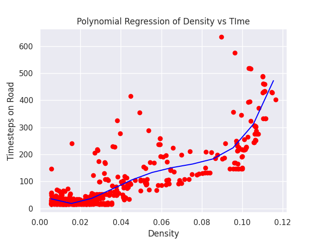

# Optimizing Traffic Flow and Travel Time Using Multi-Agent Systems
## Group C17 - Design of Multi Agent System - University Of Groningen - Master of Science Artificial Intelligence

### Group Members:
 * Adithya M.S (s4214633)
 * Bram de Wit (s3151654)
 * Rik Vegter (s3147495)
 * Daniel Marouf (s4503619)

# About our Project

In this study, an approach using Multi-Agent Systems was used in order to optimize traffic flow and travel time. A new perspective is used in which agents implicitly communicate with each other by publishing their planned routes to a central agent. Agents can communicate with this central agent to foresee traffic jams and hence they will dynamically plan their route in order to minimize their own travel time. It is expected that this will also have a positive impact on the travel time, waiting time and the traffic congestion of all systems. OSMnx was used to simulate a part of the map of Manhattan, to make the simulation as realistic as possible. The results were compared to a baseline where all route planning was static. \textit{Small summary of results need to be included here when available.

# Packages

## [Folium](https://python-visualization.github.io/folium/index.html) - Map parser

'Folium builds on the data wrangling strengths of the Python ecosystem and the mapping strengths of the leaflet.js library. Manipulate your data in Python, then visualize it in on a Leaflet map via folium.'

## [OSMNX](https://github.com/gboeing/osmnx) - Map libary

'Python for street networks
Retrieve, model, analyze, and visualize OpenStreetMap street networks and other spatial data.
Citation info: Boeing, G. 2017. "OSMnx: New Methods for Acquiring, Constructing, Analyzing, and Visualizing Complex Street Networks." Computers, Environment and Urban Systems 65, 126-139. doi:10.1016/j.compenvurbsys.2017.05.004'

## [Cityflow](https://cityflow-project.github.io/) - Simulation base

'CityFlow is a new designed open-source traffic simulator, which is much faster than SUMO (Simulation of Urban Mobility).

CityFlow can support flexible definitions for road network and traffic flow based on synthetic and real-world data. It also provides user-friendly interface for reinforcement learning. Most importantly, CityFlow is more than twenty times faster than SUMO and is capable of supporting city-wide traffic simulation with an interactive render for monitoring. Besides traffic signal control, CityFlow could serve as the base for other transportation studies and can create new possibilities to test machine learning methods in the intelligent transportation domain.'
## [Astar](https://github.com/jrialland/python-astar) - A-* algorithm implementation

'This is a simple implementation of the a-star path finding algorithm in python.'
## Other packages

* [Numpy](https://numpy.org/doc/stable/) - Multidimensional array
* [Matplotlib](https://matplotlib.org/3.3.2/contents.html) - Plot
* [Seaborn](https://seaborn.pydata.org/) - Statistical data visualization


# Installation
We recommend Docker for macOS because Cityflow use C based environment which is not working on Mac. Linux based OS could use both installations. 
## 1.  Docker

### Docker Installation
https://docs.docker.com/engine/install/
# Docker Build
Clone repository, build Docker:
```
git clone https://github.com/Swopper050/C17-traffic-flow-optimization.git
cd C17-traffic-flow-optimization
docker build -t traffic_opt .
```
**Docker run:**
```
sudo docker run -dit --name traffic traffic_opt
sudo docker exec -i -t traffic bin/bash
cd /home/C17-traffic-flow-optimization/
```
## 2. Virtual environment

Clone repository. Install virtualenv, make virtual environment and install dependencies:
```
git clone https://github.com/Swopper050/dmas2020.git
cd dmas2020
pip install virtualenv
python -m venv .env
pip install -r requirements.txt
sudo apt update && sudo apt install -y build-essential cmake
git clone https://github.com/cityflow-project/CityFlow.git 
cd citiflow
pip install .
```

# Running the simulation

### Default parameters:  
* map: low_monhattan  (Map Directory)
* Max Steps : 500 (Integer)
* Initial cars: 500 (Integer)
* New car / step : 1 (Integer)

### Printing the following statistics
* Average travel time 
* Free flow avg travel time 
* Average % waiting vehicles 
* Travel Time Index 
## Static
```
python3 run_static_routing_simulation.py --dir low_manhattan_sim --max_steps 500 --cars_per_step 1 --init_cars 500
```
## Dynamic
```
python3 run_dynamic_routing_simulation.py --dir low_manhattan_sim --max_steps 500 --cars_per_step 1 --init_cars 500

```
### Generated Replay files and plot for visualsation:
```
low_manhattan_sim/replay.txt 
low_manhattan_sim/replay_roadnet.json 
low_manhattan_sim/waiting_vehicles.png .
```
**Upload replay files here:**
http://108.61.178.181:6969/show


# From VM (only default parameters)

http://108.61.178.181:6970/traffic_sim

# Results
Simulation parameters|Travel time         |  Travel Time index | Waiting percent
:-------------------------:|:-------------------------:|:-------------------------:|:-------------------------:
500 steps, 500 cars| |  | 
500 steps, 750 cars| | | 
500 steps, 1000 cars| | | 
1000 steps, 500 cars|| | 
1000 steps, 750 cars|| | 
1000 steps, 1000 cars|| | 
1500 steps, 500 cars|| | 
1500 steps, 750 cars|| | 
1500 steps, 1000 cars|| | 



